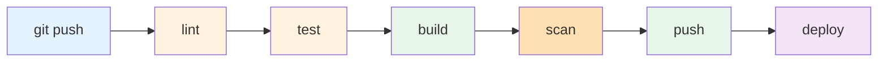

# hello-gin-k8s

KubernetesのCI/CDパイプラインテスト用にGinフレームワークを使って作成したHello Worldアプリケーションです。
<目的>  
Kubernetesへのデプロイを含むGitLab CI/CDパイプラインの検証用サンプルプロジェクトです。

## 🚀 Features

- **フレームワーク**: Gin (Go web framework)
- **エンドポイント**:
  - `GET /` - Hello World message
  - `GET /health` - Health check
  - `GET /version` - Version information
  - `GET /env` - Environment information
- **テスト**: Unit tests with testify
- **Docker**: Multi-stage build with Alpine Linux
- **CI/CD**: GitLab CI pipeline
- **Deployment**: Kubernetes manifests

## 📋 Requirements

- Go 1.24+
- Docker
- Kubernetes cluster (K3s)
- GitLab with Container Registry

## 🛠️ Local Development

### Install dependencies
```bash
go mod download
```

### Run application
```bash
go run main.go
```

### Run tests
```bash
# Run all tests
go test -v
```

### Build and run with Docker
```bash
# Build image
docker build \
  --build-arg VERSION=1.0.0 \
  --build-arg GIT_COMMIT=abc123 \
  -t hello-gin-k8s:test \
  .

# Run container
docker run -d -p 8080:8080 --name hello-gin-test hello-gin-k8s:test

# Test endpoints
curl http://localhost:8080/
curl http://localhost:8080/health
curl http://localhost:8080/version
curl http://localhost:8080/env

# Stop and remove
docker stop hello-gin-test
docker rm hello-gin-test
```

## 📦 Environment Variables

| Variable | Description | Default |
|----------|-------------|---------|
| `APP_ENV` | Application environment | `development` |
| `VERSION` | Application version | `1.0.0` |
| `GIT_COMMIT` | Git commit SHA | `unknown` |

## 🏗️ Project Structure
```
.
├── main.go              # Application entry point
├── main_test.go         # Unit tests
├── go.mod              # Go module definition
├── go.sum              # Go module checksums
├── Dockerfile          # Docker image definition
├── .gitlab-ci.yml      # CI/CD pipeline
├── .gitignore          # Git ignore rules
├── k8s/                # Kubernetes manifests
│   ├── deployment.yaml
│   ├── service.yaml
│   ├── ingress.yaml
│   └── configmap.yaml
└── README.md           # This file
```

## 🚢 Deployment

Deployment is automated via GitLab CI/CD pipeline:

1. Push code to GitLab
2. CI pipeline runs tests
3. Build Docker image
4. Push to GitLab Container Registry
5. Deploy to Kubernetes cluster

See `.gitlab-ci.yml` for details.

## パイプライン全体像


B：コードチェック  
C：単体テスト＋カバレッジ  
D：Dockerイメージビルド  
E：脆弱性スキャン(Trivy)  
F：Container Registryへpush  
G：k8sへデプロイ
## 📝 License

This is a sample project for learning purposes.